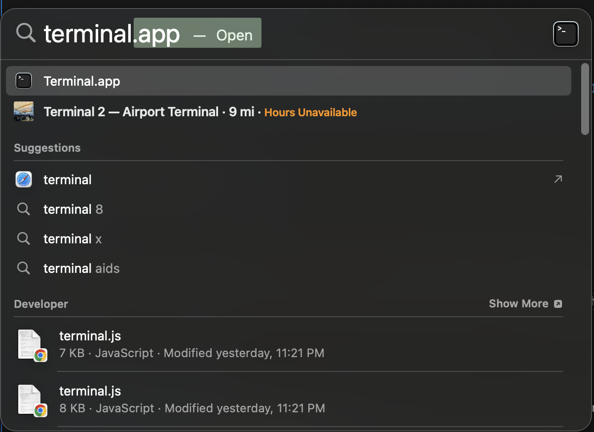
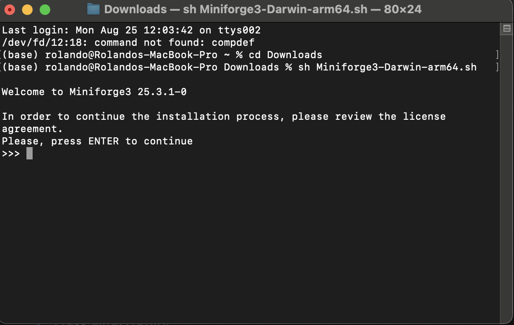
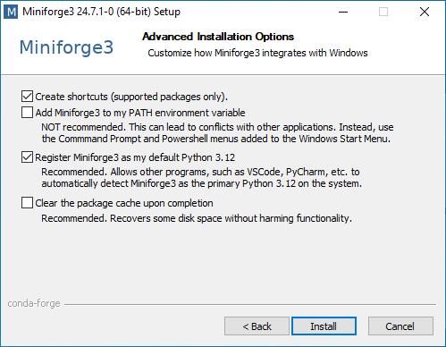
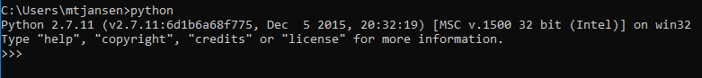

 <h1>Setup</h1> 

## Miniforge

We currently recommend the miniforge installer, which includes:

* Python  
* Conda helps manage and install Python packages and other tools and creates and manages virtual environments.
* Mamba is a C++ version of conda that can be faster for some tasks.  You can usually use the two interchangeably.
* Defaults to install packages from the conda-forge repository

### Alternative: JupyterLite via Jupyter.org

> If you would like to use Python for the duration of this workshop without downloading anything (or have problems downloading Miniforge), we recommend using [JupyterLite](https://jupyter.org/try-jupyter/lab/). JupyterLite runs completely inside your browser using WebAssembly and Pyodide and provides an identical interface to the JupyterLab IDE we'll be using for the workshop.  You can drag and drop files to upload example data later on, and you can right click on any files to download them for later use.  [Read more about JupyterLite](https://jupyterlite.readthedocs.io/en/latest/index.html)   **Note:** If you run into issues with JupyterLite hanging or being unable to run code, try running it in a "Private" browser window, or try clearing your browser cache.  This will reset the service, so **make sure to save any files** you need before clearing the cache!

### Alternative: Open OnDemand (UNC Research Computing)

> If you have access to UNC's [Longleaf cluster](https://help.rc.unc.edu/request-a-cluster-account/), you can use Python with the Spyder IDE or Jupyter Lab in a web browser on Research Computing's [Open OnDemand service](https://help.rc.unc.edu/ondemand/).  This service runs on the Longleaf cluster so it's a great option for complex or long-running Python scripts.

## Installation

### If you're coming from an Anaconda installation

If you're moving from Anaconda to Miniforge, you'll need to do a little bit of preparation first.

1. Uninstall Anaconda
2. Check that any remaining .condarc files are deleted. These are often in the following folders:\
    PC: C:/Users/username/.condarc\
    Mac: /Users/username/.condarc\
    (replace "username" with your username)

### Downloading and Installing Miniforge

[Download the installer here.](https://conda-forge.org/download/).

**Mac Users: Pay particular attention to whether you need the Apple Silicon (M1, M2, etc.) or Intel version.**

<table>

<tr>
<th> <h3>Mac Installation</h3> </th>
<th> <h3>PC Installation</h3> </th>
</tr>
<tr>
<td>

1. Download the install script to your `Downloads` folder (default location)

2. <strong>Open up your terminal</strong> 
To open your terminal, you can either:
1) Navigate to `Applications>Utilities>Terminal`  
Or 
2) Use Spotlight Search
    *  Press `Command+Space` to open Spotlight Search
    *  Type `terminal` in Spotlight search
    *  Press enter/return

&nbsp;&nbsp;&nbsp; 

3. <strong> Run Installation Script </strong> 
* Within the terminal, type `cd Downloads` then press enter/return (this navigates you to the downloads folder)
* Type `sh Mini` then press the tab button, this should autocomplete the installation file (e.g. `sh Miniforge3-Darwin-arm64.sh`)
* press enter/return to run installation and follow installation steps

&nbsp;&nbsp;&nbsp; 

4. <strong> Recommended: Restart Machine </strong>
Restart your machine after the installation has been complete. You should now be able to open your terminal again, type `which python` and see `/Users/<USERNAME>/miniforge3/bin/python`
 

</td>
<td>
<strong>1. PATH</strong> 

&nbsp;&nbsp;&nbsp;Do not add Miniforge to your PATH variable. This may interfere with any existing Python-dependent software on your computer. 
    
&nbsp;&nbsp;&nbsp;  
  
<strong>2. Registering Python</strong> 
    
&nbsp;&nbsp;&nbsp;If you are installing Python for the first time, select "Register Miniforge as the system Python" 
    
&nbsp;&nbsp;&nbsp;If you have Python-dependent software (e.g. ArcGIS, CAD software, etc), do not check "Register Miniforge as the system Python" or it may cause issues. 

<blockquote>If you're unsure, open your PC's Command Line (Start>Windows System>Command Prompt) or Mac's Terminal (Applications>Utilities>Terminal) and type `python` and press Enter.  If you already have Python you should see something like the image below - do not check Register Anaconda as the system Python.</blockquote>
    
&nbsp;&nbsp;&nbsp;   

 
</td>
</tr>

</table>
  
## Installing Python packages

Miniconda does not include all of the Python packages we'll be using in the workshops.  We'll need to install them manually.

1. Open the terminal (Mac) or Miniforge Prompt (PC)
    * Mac: Finder > Applications > Utilities > Terminal
    * PC: Start Menu > Miniforge3 > Miniforge Prompt

2. If coming from an Anaconda installation, check the channels list with:\
    `conda config --show channels`
    
* If the channels list is *only* `conda-forge`, continue to step 3.
* If the channels list starts with `default`, you probably have an old .condarc file leftover from Anaconda.
    + run `conda config --show-sources` to see likely locations (any file not in a miniforge folder)
    + check C:/Users/username/.condarc on PC, or /Users/username/.condarc on Mac (replace "username" with your username)

3. Run the following to install some key packages:

    `conda install jupyterlab pandas seaborn matplotlib bokeh`\
    or\
    `mamba install jupyterlab pandas seaborn matplotlib bokeh`

    type `Y` to accept the install if prompted

4. Optionally install these packages that we'll briefly cover in a survey during the final workshop:

    `conda install nltk beautifulsoup4 scikit-learn pillow polars duckdb joblib`\
    or\
    `mamba install nltk beautifulsoup4 scikit-learn pillow polars duckdb joblib`\
    then we'll install one package only available through `pip`\
    `pip install noaa_sdk`

## FAQs

### What's the difference between `conda` and `mamba`?

`mamba` translates most `conda` functionality from Python into C++, which can make some tasks a little faster.  They're usually interchangeable!

### Why not work with an existing installation?

If you use macOS or Linux, then you most likely already have Python on your computer!  Python does not come with Windows, but it may be on your machine as part of other software (e.g. ArcGIS Desktop).

However, unless you've worked with Python already, your pre-existing installation may only include the bare minimum and may be an out of date version.  Therefore, we recommend a new installation with some extra tools for all operating systems.

### Why not use `pip` + `venv`?

The `pip` and `venv` packages are usually included with a new Python installation and cover much of the functionality of `conda`/`mamba` - installing Python packages and creating and managing virtual environments.  However, `conda`/`mamba` can also install other programming languages and tools, while still using `pip` if needed.

### Why not Anaconda?

The Anaconda distribution includes conda and Python along with a large curated collection of data science oriented packages.  However, Anaconda is only free to use for certain types of users.  [Read more here](https://www.anaconda.com/legal)

<table>
  <thead>
    <tr>
      <th>Mac Installation</th>
      <th>PC Installation</th>
    </tr>
  </thead>
  <tbody>
    <tr>
      <td markdown="1">

1. Download the install script to your `Downloads` folder (default location)

2. **Open up your terminal**  
   To open your terminal, you can either:  
   1) Navigate to `Applications>Utilities>Terminal`  
   Or  
   2) Use Spotlight Search
      * Press `Command+Space` to open Spotlight Search
      * Type `terminal` in Spotlight search
      * Press Enter/Return

3. **Run Installation Script**  
   * Within the terminal, type `cd Downloads` then press Enter/Return (this navigates you to the Downloads folder)
   * Type `sh Mini` then press the Tab key; this should autocomplete the installation file (e.g., `sh Miniforge3-Darwin-arm64.sh`)
   * Press Enter/Return to run the installer and follow the prompts

4. **Recommended: Restart Machine**  
   Restart your machine after the installation is complete. You should now be able to open your terminal again, type `which python` and see `/Users/<USERNAME>/miniforge3/bin/python`.

      </td>
      <td markdown="1">

**1. PATH**  
Do not add Miniforge to your PATH variable. This may interfere with any existing Python-dependent software on your computer.

**2. Registering Python**  
If you are installing Python for the first time, select “Register Miniforge as the system Python.”

If you have Python-dependent software (e.g., ArcGIS, CAD software, etc.), **do not** check “Register Miniforge as the system Python,” or it may cause issues.

> If you're unsure, open your PC's Command Prompt (Start > Windows System > Command Prompt) or Mac's Terminal (Applications > Utilities > Terminal), type `python`, and press Enter. If you already have Python you should see something like the image below — **do not** check “Register Anaconda as the system Python.”

      </td>
    </tr>
  </tbody>
</table>
