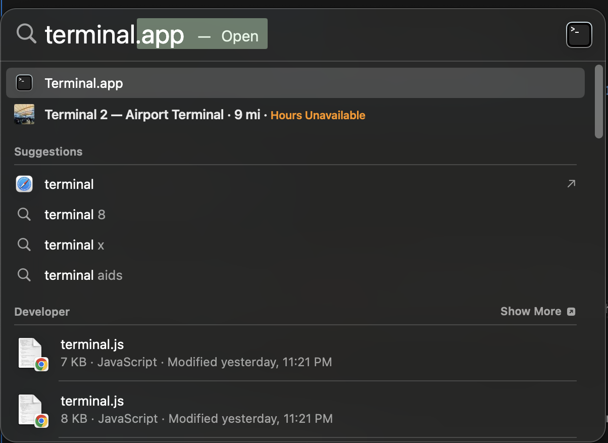
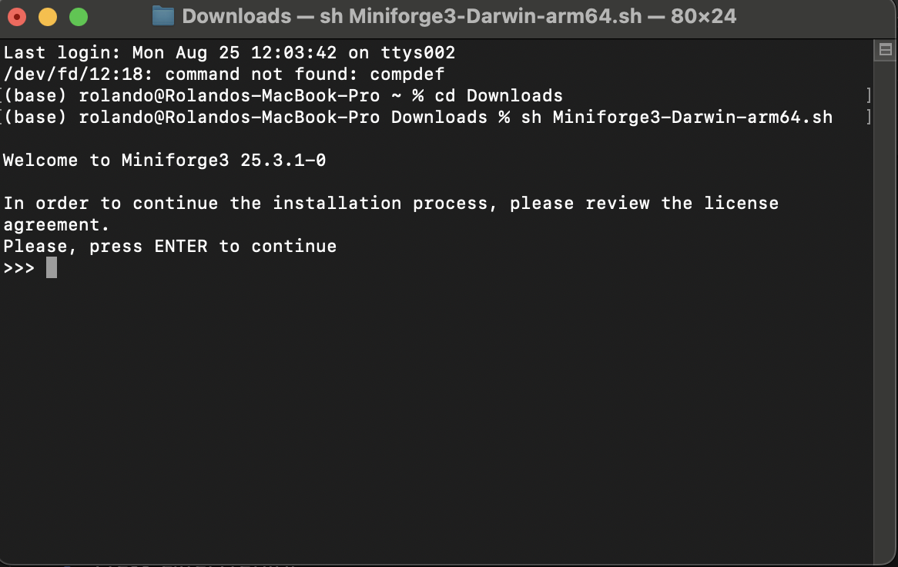
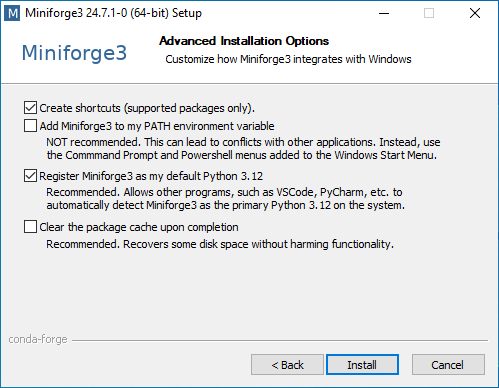
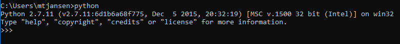

 <h1>Setup</h1> 

## Miniforge

We currently recommend the miniforge installer, which includes:

* Python  
* Conda helps manage and install Python packages and other tools and creates and manages virtual environments.
* Mamba is a C++ version of conda that can be faster for some tasks.  You can usually use the two interchangeably.
* Defaults to install packages from the conda-forge repository

### Local Install Alternatives: 

#### JupyterLite via Jupyter.org

> If you would like to use Python for the duration of this workshop without downloading anything (or have problems downloading Miniforge), we recommend using [JupyterLite](https://jupyter.org/try-jupyter/lab/). JupyterLite runs completely inside your browser using WebAssembly and Pyodide and provides an identical interface to the JupyterLab IDE we'll be using for the workshop.  You can drag and drop files to upload example data later on, and you can right click on any files to download them for later use.  [Read more about JupyterLite](https://jupyterlite.readthedocs.io/en/latest/index.html)   **Note:** If you run into issues with JupyterLite hanging or being unable to run code, try running it in a "Private" browser window, or try clearing your browser cache.  This will reset the service, so **make sure to save any files** you need before clearing the cache!

#### Open OnDemand (UNC Research Computing)

> If you have access to UNC's [Longleaf cluster](https://help.rc.unc.edu/request-a-cluster-account/), you can use Python with the Spyder IDE or Jupyter Lab in a web browser on Research Computing's [Open OnDemand service](https://help.rc.unc.edu/ondemand/).  This service runs on the Longleaf cluster so it's a great option for complex or long-running Python scripts.

#### Cloud environments

Two of the most popular Cloud-based development environments are [Google Colab](https://colab.research.google.com/) and [GitHub Codespaces](https://github.com/codespaces).  Both have Jupyter-style notebooks available that should allow you to follow along, and may have additional compute time available for student/academic accounts.  You should be hesitant to use these services with any senstive data.

## Installation

### VS Code

[Download and install VS Code](https://code.visualstudio.com/download).  Leave defaults and click through.

### uv

We'll use uv to manage virtual environments and package installs today.  We'll follow the [uv installation instructions](https://docs.astral.sh/uv/getting-started/installation/#installing-uv) for your operating system.

For Mac:
Open the Terminal and run: 
 `curl -LsSf https://astral.sh/uv/install.sh | sh` or  `wget -qO- https://astral.sh/uv/install.sh | sh`

For PC:
Open Powershell and run: 
`powershell -ExecutionPolicy ByPass -c "irm https://astral.sh/uv/install.ps1 | iex"`

Restart your Terminal or Powershell and type `uv -h` to see the help documentation (and ensure installation was successful).

### Getting started in uv and VS Code

We'll work through the following instructions in the workshop, but feel free to try them out ahead of time!

#### uv setup

Create a folder for the workshop.  For example we could create a folder called "python_workshop" on the desktop.

In Terminal or Powershell we need to move to this new folder: 
`cd ~/Desktop/python_workshop`

We can create a new uv project with the following command: 
`uv init --bare`

* The `--bare` option above tells uv to forgo creating other files that aren't usually going to be useful in scientific compute settings.

This creates some files and folders in your project folder to get us started. However to really get going we'll need to add some packages: 
`uv add jupyter ipykernel`

Adding packages automatically installs Python, the packages we've requested, and any dependencies they have (there are always lots of dependencies!).  You'll see two major updates in your folder:
* The new `.venv` folder contains all of the packages and the python executable we'll use for this project.  
* At the top level, our `pyproject.toml` file is updated to reflect the newly required packages, and the `uv.lock` file records what we're actually using.  (You generally won't need to edit your .toml file and you **should not** modify your .lock file.)  These files are the essential ingredients to reproducing your environment somewhere else!

#### Moving to VS Code

We'll run a couple of commands in our Powershell or Terminal window: 
`code --install-extension ms-python.python`
`code --install-extension ms-toolsai.jupyter`

These commands will install the Jupyter and Python extensions in our code environment.  Once these have installed, we can make sure we're in our project folder: 
`cd ~/Desktop/python_workshop`

Then we can run: 
`code`

to start VS Code.  If that does not work, you can start VS code from the Start Menu (PC) or Launcher (Mac), then use File>Open Folder to graphically open your project folder.

By default, VS Code opens new folders in restricted mode.  Since we'll be working in this folder, we'll want to make it Trusted.  To do this we can click the blue "Restricted Mode" button at the bottom left of the VS code window, then click Trust.

#### Jupyter Notebook

Use File>New File>Jupyter Notebook to create a new Jupyter Notebook file.  In the top right of your new ipynb window, you'll see "Detecting Kernels" - this may successfully map to the Python kernel we've set up with uv, but if not, you can click "Select Kernel", then choose Python Environments, and choose the "python-workshop" kernel with the path `.venv\Scripts\python.exe` (PC) or `.venv/bin/python` (Mac).

#### Troubleshooting:

If you have trouble finding the kernel, here are three things to check.
1. Make sure that the folder is trusted - you should *not* see "Restricted Mode" in the bottom left of your VS code window.
2. Try CTRL/CMD + SHIFT + P to open the command palette. Then search for "Developer: Reload Window" to refresh your session.
3. If necessary, you can manually point to an interpreter with: 
  - CTRL/CMD + SHIFT + P to open the command palette
  - Choose "Python: Select Interpreter"
  - Chooose "Enter interpreter path"
  - Paste `.venv\Scripts\python.exe` (PC) or `.venv/bin/python` (Mac).

### Adding and managing packages

There are three ways we'll work with python packages.

#### `uv add`

The simplest way to add a pacakge is to run: 
`uv add <package-name>`

For example: 
`uv add pandas matplotlib` 
installs two packages and their required dependencies.

#### `uv pip install`

We can similarly use the `pip` package manager within `uv` with `uv pip install`.

For example: 
`uv pip install pandas matplotlib`

However, this process does not update the "project files" - the .toml and .lock files, therefore can be less reproducible.

#### .toml (and .lock) files

Finally, if we're picking up a project from someone else (or our own older work), we can use `uv sync` to recreate the same environment when a .toml file (and if available, .lock file) is present in the folder.  

## OLD: Miniforge Instructions
### If you're coming from an Anaconda installation

If you're moving from Anaconda to Miniforge, you'll need to do a little bit of preparation first.

1. Uninstall Anaconda
2. Check that any remaining .condarc files are deleted. These are often in the following folders:\
    PC: C:/Users/username/.condarc\
    Mac: /Users/username/.condarc\
    (replace "username" with your username)

### Downloading and Installing Miniforge

[Download the installer here.](https://conda-forge.org/download/).

**Mac Users: Pay particular attention to whether you need the Apple Silicon (M1, M2, etc.) or Intel version.**

<table class="install-table">
  <thead>
    <tr>
      <th>Mac Installation</th>
      <th>PC Installation</th>
    </tr>
  </thead>
  <tbody>
    <tr>
      <td markdown="1">

1. Download the install script to your `Downloads` folder (default location).

2. **Open up your terminal**  
   To open your terminal, you can either:  
   1. Navigate to `Applications > Utilities > Terminal`  
   **Or**  
   2. Use Spotlight Search  
      - Press `Command+Space` to open Spotlight Search  
      - Type `terminal` in Spotlight search  
      - Press Enter/Return

{: width="500" height="277" }

3. **Run Installation Script**  
   - In the terminal, type `cd Downloads` then press Enter/Return (this navigates you to the Downloads folder).  
   - Type `sh Mini` then press **Tab** to autocomplete the installer file (e.g., `sh Miniforge3-Darwin-arm64.sh`).  
   - Press Enter/Return to run the installer and follow the prompts.

{: width="500" height="277" }

4. **Recommended: Restart Machine**  
   Restart your machine after the installation is complete. You should now be able to open your terminal again, type `which python`, and see `/Users/<USERNAME>/miniforge3/bin/python`.

</td>
<td markdown="1">

**1. PATH**  
Do **not** add Miniforge to your PATH variable. This may interfere with any existing Python‑dependent software on your computer.

{: width="499" height="388" }

**2. Registering Python**  
- If you are installing Python for the first time, select “Register Miniforge as the system Python.”  
- If you have Python‑dependent software (e.g., ArcGIS, CAD software), **do not** check “Register Miniforge as the system Python,” or it may cause issues.

> If you're unsure, open your PC’s Command Prompt (Start > Windows System > Command Prompt) or Mac’s Terminal (Applications > Utilities > Terminal), type `python`, and press Enter. If you already have Python you should see something like the image below — **do not** check “Register Anaconda as the system Python.”

{: width="781" height="87" }

</td>
</tr>

</tbody>

</table>

## Installing Python packages

Miniconda does not include all of the Python packages we'll be using in the workshops.  We'll need to install them manually.

1. Open the terminal (Mac) or Miniforge Prompt (PC)
    * Mac: Finder > Applications > Utilities > Terminal
    * PC: Start Menu > Miniforge3 > Miniforge Prompt

2. If coming from an Anaconda installation, check the channels list with:\
    `conda config --show channels`
    
* If the channels list is *only* `conda-forge`, continue to step 3.
* If the channels list starts with `default`, you probably have an old .condarc file leftover from Anaconda.
    + run `conda config --show-sources` to see likely locations (any file not in a miniforge folder)
    + check C:/Users/username/.condarc on PC, or /Users/username/.condarc on Mac (replace "username" with your username)

3. Run the following to install some key packages:

    `conda install jupyterlab pandas seaborn matplotlib bokeh`\
    or\
    `mamba install jupyterlab pandas seaborn matplotlib bokeh`

    type `Y` to accept the install if prompted

4. Optionally install these packages that we'll briefly cover in a survey during the final workshop:

    `conda install nltk beautifulsoup4 scikit-learn pillow polars duckdb joblib`\
    or\
    `mamba install nltk beautifulsoup4 scikit-learn pillow polars duckdb joblib`\
    then we'll install one package only available through `pip`\
    `pip install noaa_sdk`

## Integrated Development Environments (IDEs)

We'll primarily teach in JupyterLab since it is easily installed with conda.  If you're already familiar with a different development environment (VS Code, Spyder, PyCharm, Google Colab, Positron etc.), you're welcome to use it.  It will be easiest to follow along if your environment supports Jupyter Notebooks or a similar notebook format.  Our ability to troubleshoot other environments during the workshop may be limited.

## FAQs

### What's the difference between `conda` and `mamba`?

`mamba` translates most `conda` functionality from Python into C++, which can make some tasks a little faster.  They're usually interchangeable!

### Why not work with an existing installation?

If you use macOS or Linux, then you most likely already have Python on your computer!  Python does not come with Windows, but it may be on your machine as part of other software (e.g. ArcGIS Desktop).

However, unless you've worked with Python already, your pre-existing installation may only include the bare minimum and may be an out of date version.  Therefore, we recommend a new installation with some extra tools for all operating systems.

### Why not use `pip` + `venv`?

The `pip` and `venv` packages are usually included with a new Python installation and cover much of the functionality of `conda`/`mamba` - installing Python packages and creating and managing virtual environments.  However, `conda`/`mamba` can also install other programming languages and tools, while still using `pip` if needed.

### Why not Anaconda?

The Anaconda distribution includes conda and Python along with a large curated collection of data science oriented packages.  However, Anaconda is only free to use for certain types of users.  [Read more here](https://www.anaconda.com/legal)
